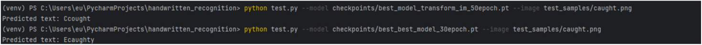
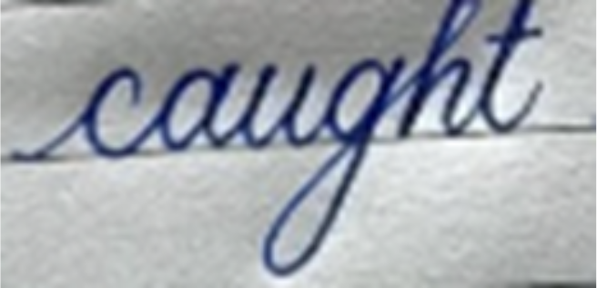

# CRNN Handwritten Text Recognition

Acest proiect implementează un model CRNN (Convolutional Recurrent Neural Network) pentru recunoașterea textului scris de mână folosind IAM Handwriting Dataset.  
Modelul folosește PyTorch, CTC Loss și include augmentări de date, salvare de checkpoint-uri și testare pe imagini individuale.
<p align="center">
  
  
</p>

## Cerințe

- Python 3.8+
- PyTorch
- OpenCV
- NumPy
- torchvision
- TensorBoard

Instalare rapidă:
```bash
pip install torch torchvision opencv-python numpy tensorboard
```

## Dataset

Proiectul folosește [IAM Handwriting Dataset](http://www.fki.inf.unibe.ch/databases/iam-handwriting-database).  
Asigură-te că ai descărcat datasetul și că structura arată astfel:
```
data/iam_dataset/
│   words.txt
└── words/
    ├── a01/
    │   ├── a01-000u/
    │   │   ├── a01-000u-00-00.png
    │   │   └── ...
    └── ...
```

În `config.py`, setează:
```python
DATA_PATH = "./data/iam_dataset"
```

## Antrenare

Pentru a antrena modelul de la zero:
```bash
python train.py --epochs 100 --batch-size 64
```

Opțiuni utile:
- `--resume-checkpoint` – pentru a relua antrenarea dintr-un checkpoint salvat.

În timpul antrenării, log-urile se salvează în TensorBoard:
```bash
tensorboard --logdir logs
```

## Testare

Pentru a testa un model pe o imagine:
```bash
python test.py --image path/la/imagine.png --model checkpoints/best_model.pt
```

## Modelul CRNN

Arhitectura este formată din:
- CNN – extragere de caracteristici din imagine
- RNN (LSTM bidirecțional) – procesarea secvențială a caracteristicilor
- CTC Loss – antrenare pentru recunoașterea secvențelor cu lungime variabilă

## Augmentări de date

Loaderul de date aplică transformări pentru a îmbunătăți generalizarea:
- Rotiri și shear
- Zoom variabil
- Color jitter
- Blur gaussian
- Noise gaussian

## Checkpoint-uri

După fiecare epocă:
- `checkpoints/checkpoint_epoch_X.pt` – starea modelului la epoca X
- `checkpoints/best_model.pt` – cel mai bun model conform pierderii pe setul de validare
